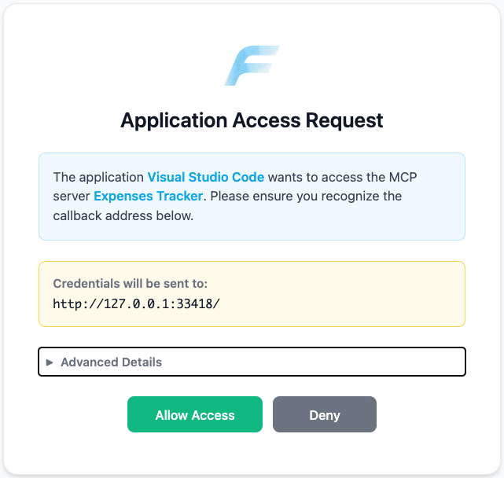
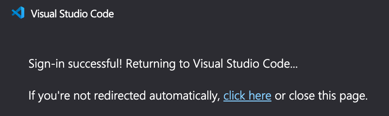
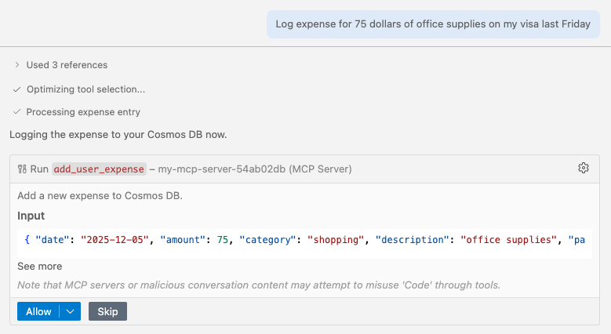
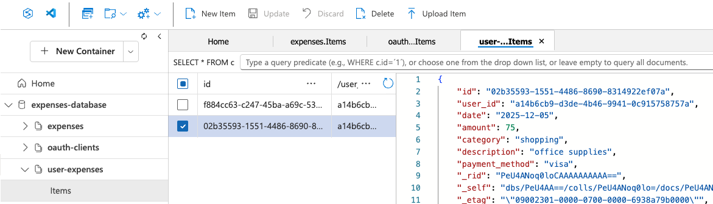

# Identity-Aware MCP Server with Azure Cosmos DB

A Python MCP server that authenticates users via Microsoft Entra ID and stores per-user data in Azure Cosmos DB, deployed to Azure Container Apps.

## Table of Contents

- [Getting started](#getting-started)
  - [GitHub Codespaces](#github-codespaces)
  - [VS Code Dev Containers](#vs-code-dev-containers)
  - [Local environment](#local-environment)
- [Deploy to Azure](#deploy-to-azure)
- [Run and test locally](#run-and-test-locally)
- [Use with GitHub Copilot](#use-with-github-copilot)
- [Deploy with private networking](#deploy-with-private-networking)
- [Viewing traces](#viewing-traces)
- [Resources](#resources)

## Getting started

You have a few options for setting up this project. The quickest way to get started is GitHub Codespaces, since it will setup all the tools for you, but you can also set it up locally.

### GitHub Codespaces

You can run this project virtually by using GitHub Codespaces. Click the button to open a web-based VS Code instance in your browser:

[](https://codespaces.new/pamelafox/python-mcp-demo)

Once the Codespace is open, open a terminal window and continue with the deployment steps.

### VS Code Dev Containers

A related option is VS Code Dev Containers, which will open the project in your local VS Code using the [Dev Containers extension](https://marketplace.visualstudio.com/items?itemName=ms-vscode-remote.remote-containers):

1. Start Docker Desktop (install it if not already installed)
2. Open the project: [](https://vscode.dev/redirect?url=vscode://ms-vscode-remote.remote-containers/cloneInVolume?url=https://github.com/pamelafox/python-mcp-demo)
3. In the VS Code window that opens, once the project files show up (this may take several minutes), open a terminal window.
4. Continue with the deployment steps.

### Local environment

If you're not using one of the above options, then you'll need to:

1. Make sure the following tools are installed:
   - [Azure Developer CLI (azd)](https://aka.ms/install-azd)
   - [Python 3.13+](https://www.python.org/downloads/)
   - [Docker Desktop](https://www.docker.com/products/docker-desktop/)
   - [Git](https://git-scm.com/downloads)

2. Clone the repository and open the project folder.

3. Create a [Python virtual environment](https://docs.python.org/3/tutorial/venv.html#creating-virtual-environments) and activate it.

4. Install the dependencies:

   ```bash
   uv sync
   ```

5. Copy `.env-sample` to `.env` and configure your environment variables:

   ```bash
   cp .env-sample .env
   ```

## Deploy to Azure

This project can be deployed to Azure Container Apps using the Azure Developer CLI (azd). The deployment provisions:

- **Azure Container Apps** - Hosts the MCP server
- **Azure Cosmos DB** - Stores per-user expenses data
- **Azure Container Registry** - Stores container images
- **Log Analytics** - Monitoring and diagnostics

### Azure account setup

1. Sign up for a [free Azure account](https://azure.microsoft.com/free/) and create an Azure Subscription.
2. Check that you have the necessary permissions:
   - Your Azure account must have `Microsoft.Authorization/roleAssignments/write` permissions, such as [Role Based Access Control Administrator](https://learn.microsoft.com/azure/role-based-access-control/built-in-roles#role-based-access-control-administrator-preview), [User Access Administrator](https://learn.microsoft.com/azure/role-based-access-control/built-in-roles#user-access-administrator), or [Owner](https://learn.microsoft.com/azure/role-based-access-control/built-in-roles#owner).
   - Your Azure account also needs `Microsoft.Resources/deployments/write` permissions on the subscription level.

### Deploying with azd

1. Login to Azure:

   ```bash
   azd auth login
   ```

   For GitHub Codespaces users, if the previous command fails, try:

   ```bash
   azd auth login --use-device-code
   ```

2. Create a new azd environment:

   ```bash
   azd env new
   ```

   This will create a folder inside `.azure` with the name of your environment.

3. Provision and deploy the resources:

   ```bash
   azd up
   ```

   It will prompt you to select a subscription and location. This will take several minutes to complete.

4. Once deployment is complete, a `.env` file will be created with the necessary environment variables to run the server locally against the deployed resources.

### Costs

Pricing varies per region and usage, so it isn't possible to predict exact costs for your usage.

You can try the [Azure pricing calculator](https://azure.com/e/3987c81282c84410b491d28094030c9a) for the resources:

- **Azure App Service**: Basic (B1) tier. [Pricing](https://azure.microsoft.com/pricing/details/app-service/linux/)
- **Azure Cosmos DB**: Serverless tier. [Pricing](https://azure.microsoft.com/pricing/details/cosmos-db/)
- **Log Analytics** (Optional): Pay-as-you-go tier. Costs based on data ingested. [Pricing](https://azure.microsoft.com/pricing/details/monitor/)

⚠️ To avoid unnecessary costs, remember to take down your app if it's no longer in use, either by deleting the resource group in the Portal or running `azd down`.

### Use deployed MCP server with GitHub Copilot

See [Use with GitHub Copilot](#use-with-github-copilot) below.

### Running the server locally

After deployment sets up the required Azure resources (Cosmos DB, Application Insights) and Entra App Registration, you can run the MCP server locally against those resources:

```bash
cd servers && uv run uvicorn auth_entra_mcp:app --host 0.0.0.0 --port 8000
```

## Use with GitHub Copilot

The Entra App Registration includes redirect URIs for VS Code:

- `https://vscode.dev/redirect` (VS Code web)
- `http://127.0.0.1:{33418-33427}` (VS Code desktop local auth helper, 10 ports)

To use the MCP server with GitHub Copilot Chat:

1. Select "MCP: Add Server" from the VS Code Command Palette
2. Select "HTTP" as the server type
3. Enter the URL of the MCP server, either from `MCP_SERVER_URL` environment variable (for the deployed server) or `http://localhost:8000/mcp` if running locally.
4. If you get an error about "Client ID not found", open the Command Palette, run **"Authentication: Remove Dynamic Authentication Providers"**, and select the MCP server URL. This clears any cached OAuth tokens and forces a fresh authentication flow. Then restart the server to prompt the OAuth flow again.
5. You should see a FastMCP authentication screen open in your browser. Select "Allow access":

   

6. After granting access, the browser will redirect to a VS Code "Sign-in successful!" page and then bring focus back to VS Code.

   

7. Enable the MCP server in GitHub Copilot Chat tools and test it with an expense tracking query:

   ```text
   Log expense for 75 dollars of office supplies on my visa last Friday
   ```

   

8. Verify the expense was added by checking the Cosmos DB `user-expenses` container in the Azure Portal.

   

### Viewing traces in Azure Application Insights

By default, OpenTelemetry tracing is enabled for the deployed MCP server, sending traces to Azure Application Insights. To bring up a dashboard of metrics and traces, run:

```shell
azd monitor
```

Or you can use Application Insights directly:

1. Open the Azure Portal and navigate to the Application Insights resource created during deployment (named `<project-name>-appinsights`).
2. In Application Insights, go to "Transaction Search" to view traces from the MCP server.
3. You can filter and analyze traces to monitor performance and diagnose issues.

---

## Resources

* [Video series: Python + MCP (December 2025)](https://techcommunity.microsoft.com/blog/azuredevcommunityblog/learn-how-to-build-mcp-servers-with-python-and-azure/4479402)
* [MCP for beginners: Online tutorial](https://github.com/microsoft/mcp-for-beginners)
* [Python MCP servers on Azure Functions](https://github.com/Azure-Samples/mcp-sdk-functions-hosting-python)
