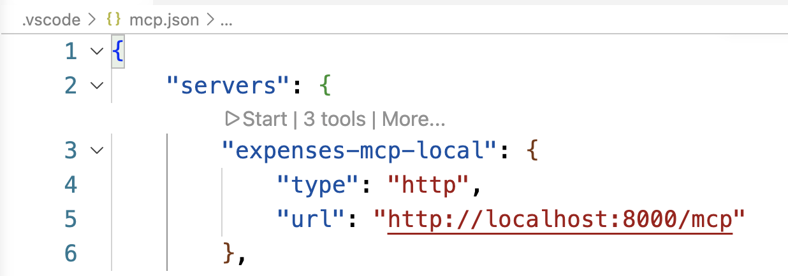
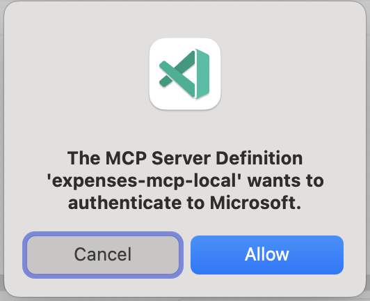
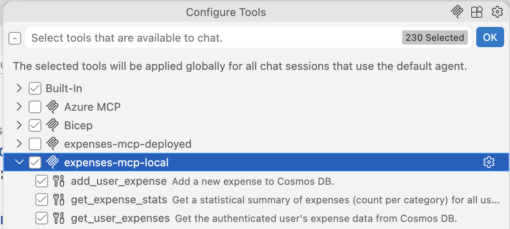
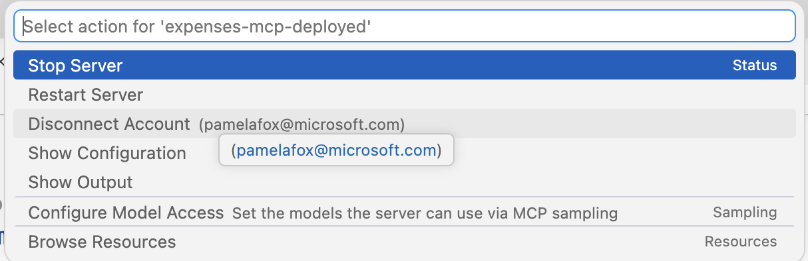

# Identity-Aware MCP Server with Azure Cosmos DB

A Python MCP server that authenticates users via Microsoft Entra ID and stores per-user data in Azure Cosmos DB, deployed to Azure Container Apps.

## Table of Contents

- [Getting started](#getting-started)
  - [GitHub Codespaces](#github-codespaces)
  - [VS Code Dev Containers](#vs-code-dev-containers)
  - [Local environment](#local-environment)
- [Deploy to Azure](#deploy-to-azure)
- [Run the MCP server locally](#run-the-mcp-server-locally)
- [Use MCP server with GitHub Copilot](#use-mcp-server-with-github-copilot)
- [Resources](#resources)

## Getting started

You have a few options for setting up this project. The quickest way to get started is GitHub Codespaces, since it will setup all the tools for you, but you can also set it up locally.

### GitHub Codespaces

You can run this project virtually by using GitHub Codespaces. Click the button to open a web-based VS Code instance in your browser:

[](https://codespaces.new/pamelafox/python-mcp-demo)

Once the Codespace is open, open a terminal window and continue with the deployment steps.

### VS Code Dev Containers

A related option is VS Code Dev Containers, which will open the project in your local VS Code using the [Dev Containers extension](https://marketplace.visualstudio.com/items?itemName=ms-vscode-remote.remote-containers):

1. Start Docker Desktop (install it if not already installed)
2. Open the project: [](https://vscode.dev/redirect?url=vscode://ms-vscode-remote.remote-containers/cloneInVolume?url=https://github.com/pamelafox/python-mcp-demo)
3. In the VS Code window that opens, once the project files show up (this may take several minutes), open a terminal window.
4. Continue with the deployment steps.

### Local environment

If you're not using one of the above options, then you'll need to:

1. Make sure the following tools are installed:
   - [Azure Developer CLI (azd)](https://aka.ms/install-azd)
   - [Python 3.13+](https://www.python.org/downloads/)
   - [Docker Desktop](https://www.docker.com/products/docker-desktop/)
   - [Git](https://git-scm.com/downloads)

2. Clone the repository and open the project folder.

3. Create a [Python virtual environment](https://docs.python.org/3/tutorial/venv.html#creating-virtual-environments) and activate it.

4. Install the dependencies:

   ```bash
   uv sync
   ```

5. Copy `.env-sample` to `.env` and configure your environment variables:

   ```bash
   cp .env-sample .env
   ```

## Deploy to Azure

This project can be deployed to Azure Container Apps using the Azure Developer CLI (azd). The deployment provisions:

- **Azure Container Apps** - Hosts the MCP server
- **Azure Cosmos DB** - Stores per-user expenses data
- **Azure Container Registry** - Stores container images
- **Log Analytics** - Monitoring and diagnostics

### Azure account setup

1. Sign up for a [free Azure account](https://azure.microsoft.com/free/) and create an Azure Subscription.
2. Check that you have the necessary permissions:
   - Your Azure account must have `Microsoft.Authorization/roleAssignments/write` permissions, such as [Role Based Access Control Administrator](https://learn.microsoft.com/azure/role-based-access-control/built-in-roles#role-based-access-control-administrator-preview), [User Access Administrator](https://learn.microsoft.com/azure/role-based-access-control/built-in-roles#user-access-administrator), or [Owner](https://learn.microsoft.com/azure/role-based-access-control/built-in-roles#owner).
   - Your Azure account also needs `Microsoft.Resources/deployments/write` permissions on the subscription level.

### Deploying with azd

1. Login to Azure:

   ```bash
   azd auth login
   ```

   For GitHub Codespaces users, if the previous command fails, try:

   ```bash
   azd auth login --use-device-code
   ```

2. Create a new azd environment:

   ```bash
   azd env new
   ```

   This will create a folder inside `.azure` with the name of your environment.

3. (Optional) Set the Entra admin group ID. This is used to restrict admin-only MCP tools to members of a specific Microsoft Entra ID security group. If not specified, the admin-only tools will not be available. You can find the group's Object ID in the [Azure Portal under Microsoft Entra ID > Groups](https://portal.azure.com/#view/Microsoft_AAD_IAM/GroupsManagementMenuBlade/~/AllGroups).

   ```bash
   azd env set ENTRA_ADMIN_GROUP_ID <your-group-object-id>
   ```

4. Provision and deploy the resources:

   ```bash
   azd up
   ```

   It will prompt you to select a subscription and location. This will take several minutes to complete.

5. Once deployment is complete, a `.env` file will be created with the necessary environment variables to run the server locally against the deployed resources.

### Costs

Pricing varies per region and usage, so it isn't possible to predict exact costs for your usage.

You can try the [Azure pricing calculator](https://azure.com/e/3987c81282c84410b491d28094030c9a) for the resources:

- **Azure App Service**: Basic (B1) tier. [Pricing](https://azure.microsoft.com/pricing/details/app-service/linux/)
- **Azure Cosmos DB**: Serverless tier. [Pricing](https://azure.microsoft.com/pricing/details/cosmos-db/)
- **Log Analytics** (Optional): Pay-as-you-go tier. Costs based on data ingested. [Pricing](https://azure.microsoft.com/pricing/details/monitor/)

⚠️ To avoid unnecessary costs, remember to take down your app if it's no longer in use, either by deleting the resource group in the Portal or running `azd down`.

## Run the MCP server locally

For easier development and debugging, you can run the MCP server locally while still using the Azure resources provisioned by the deployment (Cosmos DB, Application Insights, Entra App Registration).

After [deploying to Azure](#deploy-to-azure), the `.env` file should be populated with the necessary environment variables to connect to those resources. With that setup, you can run the MCP server locally against those resources:

```bash
cd servers && uv run uvicorn main:app --host 0.0.0.0 --port 8000
```

## Use MCP server with GitHub Copilot

To use the MCP server with GitHub Copilot Chat in VS Code:

1. Open `.vscode/mcp.json`. You should see two entries, one for the local server and one for the deployed server. To use the deployed server, replace `https://YOUR_MCP_SERVER.azurecontainerapps.io/mcp` with the URL of your deployed MCP server (from the `.env` file).

   ```json
   {
    "servers": {
     "expenses-mcp-local": {
      "type": "http",
      "url": "http://localhost:8000/mcp"
     },
     "expenses-mcp-deployed": {
      "type": "http",
      "url": "https://YOUR_MCP_SERVER.azurecontainerapps.io/mcp"
     }
    }
   }
   ```

1. Over the server that you want to use (local or deployed), select "Start" from the CodeLens options.

   

1. You should see a dialog prompting you to authenticate with Microsoft.

   

   If you get an error that the server does not support DCR, that usually means the server failed to deploy correctly. Check the server logs for errors.

1. After successful authentication, you should see "200" responses in the server logs in the Terminal, if you are running the server locally, or in the Azure Container Apps logs if you are using the deployed server.

   

1. Open the "Configure tools" dialog from GitHub Copilot Chat, and ensure that you have enabled the target MCP server (either local or deployed).

   

1. Test the MCP server by sending an expense tracking query through GitHub Copilot Chat:

   ```text
   Log expense for 75 dollars of office supplies on my visa last Friday
   ```

1. Verify the expense was added by checking the Cosmos DB `user-expenses` container in either the Azure Portal or Azure Cosmos DB extension in VS Code. You should see a new document with the expense details.

   

1. If you ever need to "log out" of the MCP server, select "More" from the CodeLens options and then "Disconnect account".

   

---

## Resources

- [Video series: Python + MCP (December 2025)](https://techcommunity.microsoft.com/blog/azuredevcommunityblog/learn-how-to-build-mcp-servers-with-python-and-azure/4479402)
- [MCP for beginners: Online tutorial](https://github.com/microsoft/mcp-for-beginners)
- [Python MCP servers on Azure Functions](https://github.com/Azure-Samples/mcp-sdk-functions-hosting-python)
